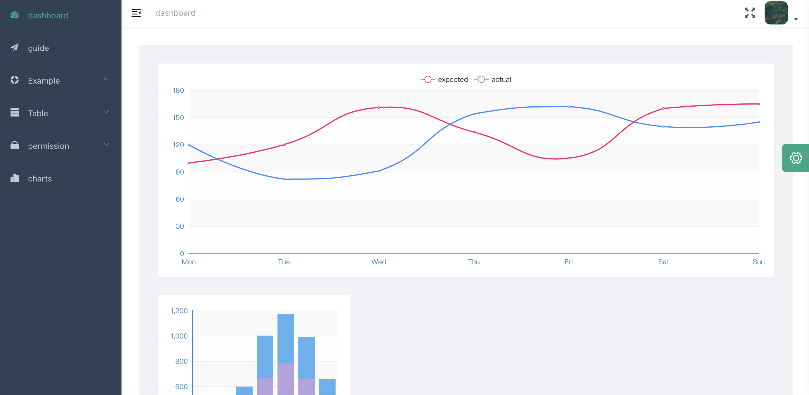

# ts-vue

<p align="center">
  <a href="https://github.com/vuejs/vue">
    
  </a>
  <a href="https://github.com/ElemeFE/element">
    
  </a>
  <a href="https://www.typescriptlang.org/">
    
  </a>
</p>

## 总览

`ts-vue`是一个中后台前端解决方案，它基于 [vue](https://github.com/vuejs/vue), [typescript](https://www.typescriptlang.org/) 和 [element-ui](https://github.com/ElemeFE/element)实现。

## 截图

### 登陆页


### 主页



## 功能

```txt
- 登录 / 注销

- 权限验证
  - 页面权限
  - 权限配置

- 多环境发布
  - Dev / Stage / Prod

- 全局功能
  - 动态换肤
  - 动态侧边栏（支持多级路由嵌套）
  - Svg 图标
  - 全屏
  - 设置
  - Mock 数据 / Mock 服务器

- 组件
  - ECharts 图表

- 表格
  - 复杂表格

- 控制台
- 引导页
- 错误页面
  - 404
```

## 前序准备

你需要在本地安装 [node](http://nodejs.org/) 和 [git](https://git-scm.com/)。本项目技术栈基于 [typescript](https://www.typescriptlang.org/)、[vue](https://cn.vuejs.org/index.html)、[vuex](https://vuex.vuejs.org/zh-cn/)、[vue-router](https://router.vuejs.org/zh-cn/) 、[vue-cli](https://github.com/vuejs/vue-cli) 、[axios](https://github.com/axios/axios) 和 [element-ui](https://github.com/ElemeFE/element)，所有的请求数据都使用[faker.js](https://github.com/Marak/Faker.js)进行模拟，提前了解和学习这些知识会对使用本项目有很大的帮助。

## 目录结构

```
|-- ts-vue
    |-- .browserslistrc     # browserslistrc 配置文件 (用于支持 Autoprefixer)
    |-- .env.development    # development环境变量配置
    |-- .env.production     # production环境变量配置
    |-- .env.test           # test环境变量配置
    |-- .eslintrc.js        # eslint 配置
    |-- .gitignore
    |-- babel.config.js     # babel-loader 配置
    |-- package-lock.json
    |-- package.json        # package.json 依赖
    |-- postcss.config.js   # postcss 配置
    |-- README.md
    |-- tsconfig.json       # typescript 配置
    |-- vue.config.js       # vue-cli 配置
    |-- mock                # mock 服务器 与 模拟数据
    |   |-- mock-server.ts
    |-- public              # 静态资源 (会被直接复制)
    |   |-- favicon.ico     # favicon图标
    |   |-- index.html      # html模板
    |-- src
    |   |-- App.vue         # 入口页面
    |   |-- main.ts         # 入口文件 加载组件 初始化等
    |   |-- peimission.ts   # 权限管理
    |   |-- settings.ts     # 设置文件
    |   |-- shims-tsx.d.ts
    |   |-- shims-vue.d.ts
    |   |-- api             # 所有请求
    |   |-- assets          # 主题 字体等静态资源 (由 webpack 处理加载)
    |   |-- components      # 全局组件
    |   |-- filters         # 全局过滤函数
    |   |-- icons           # svg 图标
    |   |-- layout          # 全局布局
    |   |-- router          # 路由
    |   |-- store           # 全局 vuex store
    |   |-- styles          # 全局样式
    |   |-- utils           # 全局方法
    |   |-- views           # 所有页面
    |-- tests               # 测试
```

## 如何设置以及启动项目

### 安装依赖

```
npm install
```

### 启动本地开发环境（自带热启动）

```
npm run serve
```

### 构建生产环境(自带压缩)

```
npm run build
```

### 执行测试

```
npm run test
```

### lint 检测

```
npm run lint
```

### 单元测试

```
npm run test:unit
```

### 自动生成 svg 组件

```bash
npm run svg
```

### 自定义 Vue 配置

请看 [Configuration Reference](https://cli.vuejs.org/config/).
